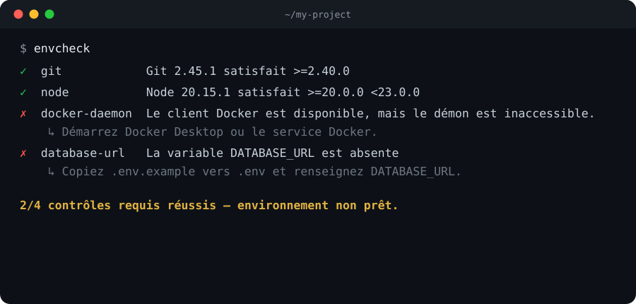
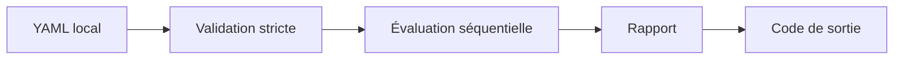

<h1 align="center">envcheck</h1>

<p align="center">
  <i>Vérifie qu'un poste de développement satisfait les prérequis d'un dépôt, avant que ça casse au make, au test ou en CI.</i>
  <br/><br/>
  <b><a href="docs/fonctionnement.md">Documentation</a></b> | <b><a href="https://github.com/SkyZonDev/envcheck">GitHub</a></b> | <b><a href="https://github.com/SkyZonDev/envcheck/releases">Releases</a></b>
  <br/><br/>
  <a href="https://github.com/SkyZonDev/envcheck/releases"></a>
  <a href="https://github.com/SkyZonDev/envcheck"></a>
  <a href="go.mod"></a>
  <a href="LICENSE"></a>
  <br/><br/>
  
</p>

<details>
  <summary><b>Table des matières</b></summary>

* [Fonctionnalités](#-fonctionnalités)
* [Pourquoi](#-pourquoi)
* [Installation](#-installation)
  * [Binaire](#binaire-recommandé)
  * [Depuis les sources](#depuis-les-sources)
* [Démarrage rapide](#-démarrage-rapide)
* [Comment ça marche](#-comment-ça-marche)
* [Configuration](#-configuration)
* [CLI](#-cli)
* [Codes de sortie](#-codes-de-sortie)
* [Documentation](#-documentation)
* [Licence](#-licence)

</details>

## 🎯 Fonctionnalités

* 🔐 **Rien ne fuit**. Les valeurs des variables d'environnement ne sont jamais lues ni affichées.
* 📄 **Contrat versionné**. Les règles vivent dans `envcheck.yml`, à côté du code.
* ⚡ **Lecture seule**. N'installe rien, ne répare rien, ne contacte aucun serveur.
* 🖥️ **Multiplateforme**. Linux, macOS, Windows — `amd64` et `arm64`.
* 🧩 **4 types de contrôles**. Commande, Docker, variable d'environnement, chemin.
* 🤖 **Prêt pour la CI**. Sortie JSON et codes de sortie exploitables.
* 🚀 **Aucune dépendance**. Un seul binaire, pas de runtime à installer.
* ✨ **Gratuit**. Entièrement open source, sous licence MIT.

## 🤔 Pourquoi

Un dépôt décrit souvent ses prérequis dans un README : « Git 2.40+, Node 20, Docker, `DATABASE_URL` ». Chacun les installe à sa manière, et le premier échec arrive trop tard — au `make`, au test ou en CI.

`envcheck` transforme cette liste en un **contrat exécutable**, versionné avec le code :

1. Le mainteneur déclare les règles dans `envcheck.yml`.
2. Le contributeur (ou la CI) lance `envcheck`.
3. Chaque règle produit un verdict, un message et éventuellement un conseil (`hint`).
4. Le code de sortie dit si l'environnement est prêt.

## 🚀 Installation

### Binaire (recommandé)

Téléchargez l'archive correspondant à votre système depuis [GitHub Releases](https://github.com/SkyZonDev/envcheck/releases), vérifiez la somme, extrayez, puis placez le binaire dans votre `PATH`.

**Cibles publiées**

| OS | Architectures |
| --- | --- |
| Linux | `amd64`, `arm64` |
| macOS | `amd64`, `arm64` |
| Windows | `amd64` |

Exemple sous Linux amd64 :

```bash
# Remplacez VERSION par le tag publié, par ex. 0.1.0
VERSION=0.1.0
curl -fsSL -O "https://github.com/SkyZonDev/envcheck/releases/download/v${VERSION}/envcheck_${VERSION}_linux_amd64.tar.gz"
curl -fsSL -O "https://github.com/SkyZonDev/envcheck/releases/download/v${VERSION}/checksums.txt"
grep -F "envcheck_${VERSION}_linux_amd64.tar.gz" checksums.txt | sha256sum -c
tar -xzf "envcheck_${VERSION}_linux_amd64.tar.gz"
sudo install -m 0755 envcheck /usr/local/bin/envcheck
envcheck --version
```

### Depuis les sources

Go 1.27 ou plus récent est requis pour compiler (voir `go.mod`). L'utilisateur final n'a pas besoin de Go une fois le binaire installé.

```bash
git clone https://github.com/SkyZonDev/envcheck.git
cd envcheck
go build -o envcheck ./cmd/envcheck
```

Ou, si le module est déjà publié :

```bash
go install github.com/SkyZonDev/envcheck/cmd/envcheck@latest
```

## ⚡ Démarrage rapide

Dans la racine d'un dépôt :

```bash
envcheck init          # écrit envcheck.yml s'il n'existe pas
# …adaptez les règles au projet…
envcheck               # équivalent à envcheck check
```

Sans `--config`, `envcheck` cherche **uniquement dans le répertoire courant** : `envcheck.yml` puis `.envcheck.yml`. Il ne remonte jamais vers les répertoires parents — un dépôt n'hérite donc jamais silencieusement de la configuration d'un autre projet.

## 🧠 Comment ça marche

`envcheck` est un **lecteur de contrat**, pas un installeur.



* Une règle en échec **n'arrête pas** les suivantes : le rapport est complet.
* `required: false` transforme un échec en **avertissement**. L'environnement reste « prêt » (code `0`) si tous les contrôles obligatoires passent.
* Les sous-processus (`git --version`, `docker info`, …) partent **sans shell**, avec un délai de **3 secondes**. La sortie brute n'entre pas dans le rapport.
* Les **valeurs** des variables d'environnement n'apparaissent jamais : un contrôle `env` dit seulement absente, vide ou définie.

**Quatre types de contrôles**

| Type | Question posée |
| --- | --- |
| `command` | Ce binaire est-il dans le `PATH` ? Sa version SemVer est-elle dans la plage demandée ? |
| `docker` | Le client `docker` existe-t-il, et le démon répond-il à `docker info` ? |
| `env` | Cette variable d'environnement est-elle définie (et non vide, sauf `allowEmpty`) ? |
| `path` | Ce fichier ou ce dossier existe-t-il, relativement au répertoire courant ? |

Le détail du pipeline, des verdicts et de l'architecture interne est dans [docs/fonctionnement.md](docs/fonctionnement.md).

## 🔧 Configuration

Exemple minimal (celui produit par `envcheck init`) :

```yaml
version: 1
projectName: my-project

checks:
  - id: git
    type: command
    command: git
    version: ">=2.40.0"
    hint: "Installez Git depuis https://git-scm.com/downloads."

  - id: docker-daemon
    type: docker
    hint: "Démarrez Docker Desktop ou le service Docker."

  - id: database-url
    type: env
    envName: DATABASE_URL
    hint: "Copiez .env.example vers .env et renseignez DATABASE_URL."

  - id: migrations
    type: path
    path: ./migrations
    kind: directory
```

`version: 1` est le numéro de **schéma YAML**, indépendant de la version du binaire. Les clés inconnues sont refusées.

Référence complète des champs : [docs/configuration.md](docs/configuration.md). Un exemple commenté se trouve aussi dans [`examples/envcheck.yml`](examples/envcheck.yml).

## 💻 CLI

| Commande | Rôle |
| --- | --- |
| `envcheck` / `envcheck check` | Charge, valide et exécute toutes les règles |
| `envcheck init` | Écrit `envcheck.yml` s'il n'existe pas |
| `envcheck init --dry-run` | Affiche le modèle sans écrire |
| `envcheck init --force` | Écrase un fichier existant |
| `envcheck --version` | Affiche la version compilée |
| `envcheck --help` | Aide et exemples |

**Options communes**

| Option | Effet |
| --- | --- |
| `--config CHEMIN` | Fichier YAML explicite (pas de découverte) |
| `--format text\|json` | Sortie humaine ou objet JSON (défaut : `text`) |
| `--quiet` | N'afficher que les non-réussites |
| `--no-color` | Couper les couleurs ANSI |

Les couleurs sont aussi désactivées hors TTY et si `NO_COLOR` est défini.

Référence CLI, codes de sortie et intégration CI : [docs/cli.md](docs/cli.md).

## 🚦 Codes de sortie

| Code | Signification |
| --- | --- |
| `0` | Exécution valide : tous les contrôles **obligatoires** réussissent |
| `1` | Exécution valide : au moins un contrôle obligatoire échoue |
| `2` | Fichier absent, YAML invalide, schéma invalide ou option incorrecte |
| `3` | Erreur interne inattendue |

En CI, `envcheck --format json` écrit **uniquement** l'objet JSON sur `stdout`. Les erreurs de configuration vont sur `stderr`.

## 📚 Documentation

| Document | Contenu |
| --- | --- |
| [docs/fonctionnement.md](docs/fonctionnement.md) | Pipeline, verdicts, sécurité d'exécution, architecture |
| [docs/configuration.md](docs/configuration.md) | Schéma YAML, champs par type, règles de validation |
| [docs/cli.md](docs/cli.md) | Commandes, options, rapport JSON, usage en CI |
| [SECURITY.md](SECURITY.md) | Ce qui ne doit jamais fuiter, signalement |
| [CONTRIBUTING.md](CONTRIBUTING.md) | Build, tests, conventions de contribution |
| [CHANGELOG.md](CHANGELOG.md) | Historique des versions |

## 📄 Licence

Ce projet est distribué sous licence [MIT](LICENSE) — © 2026 SkyZonDev.